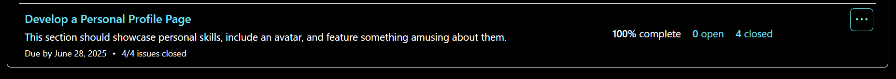

# Personal Portfolio Documentation

## 1. Student Details

- **Full Name**: Maryfancy Kariuki  
- **Admission Number**: 150828 
- **GitHub Username**: fancykariuki  
- **Email**: <maryfancy.kariuki@strathmore.edu>  

---

## 2. Deployed Portfolio Link

- **GitHub Pages URL**:  
 <https://is-project-4th-year.github.io/build-your-portfolio-github-workflow-essentials-fancykariuki/>

---

## 3. Learnings from the Git Crash Program

**What I Thought I'd Learn vs What I Actually Learned**

---

### Concept: GitHub Project Boards

- **Expectation 👀**: Looked like something used by large teams for tracking big software projects.
- **Reality 😅**: It's just a super-friendly task tracker! Dragging issues from “To Do” to “Done” felt like real progress.
- **Impact 💡**: Helped me stay on track and break down my project into small achievable steps.

---

### Concept: Branching

- **Expectation 👀**: I thought it was only for working on huge codebases.
- **Reality 😅**: It’s as simple as creating a copy of your code to safely try new features.
- **Impact 💡**: Allowed me to work on my profile section without worrying about breaking the main website.

---

### Concept: Pull Requests (PRs)

- **Expectation 👀**: Sounded like a complex code review system.
- **Reality 😅**: It's just a clean way to suggest changes and ask for approval before changing the main codebase.
- **Impact 💡**: Helped me document and explain the work I did on each feature, and kept my work clean before merging to `main`.

---

### Concept: Merge Conflicts

- **Expectation 👀**: Thought it would crash everything or be impossible to fix.
- **Reality 😅**: Just needed to read and resolve the conflicting parts.
- **Impact 💡**: I intentionally triggered and resolved one conflict when two branches edited the same `index.html`.

---

## 4. Screenshots of Key GitHub Features

### A. Milestones and Issues

#### Milestone 1 and its Issues  

  

#### Milestone 2 and its Issues  

  

### B. Project Board

  

### C. Branching

  

### D. Pull Requests

  

### E. Merge Conflict Resolution

  
